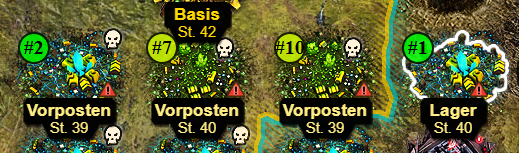
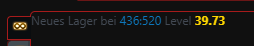

# CnC-TA Folgeposten Tracker

Ein kleines Tampermonkey-Script für **C&C Tiberium Alliances**, das die **10 neuesten Lager und Vorposten** in der Umgebung der aktuell ausgewählten eigenen Basis auf der Weltkarte markiert.

Zusätzlich werden neu entdeckte Lager und Vorposten direkt im Spielchat gemeldet.

---

## ✨ Funktionen

- Markiert die **10 neuesten Lager/Vorposten** auf der Weltkarte.
- Die Markierungen werden mit **#1 bis #10** nummeriert.
- **#1** ist immer der aktuellste gefundene Folgeposten.
- Neue Folgeposten werden automatisch im Chat gemeldet.
- Die Koordinaten in der Chatmeldung sind **anklickbar**.
- Lager und Vorposten werden automatisch unterschieden.
- Das Level des Folgepostens wird farblich hervorgehoben.
- Die Markierungen werden automatisch aktualisiert.
- Die Position der Markierungen wird während der Kartenbewegung laufend angepasst.

---

## 🏠 Referenzbasis

Der Tracker verwendet **nicht mehr automatisch die stärkste bzw. Hauptbasis**.

Stattdessen wird immer die **aktuell ausgewählte eigene Basis** als Referenz verwendet.

Das bedeutet:

- Eigene Basis **A** auswählen → Folgeposten werden in der Umgebung von **A** gesucht.
- Eigene Basis **B** auswählen → Folgeposten werden in der Umgebung von **B** gesucht.
- Die Offensivstufe der ausgewählten Basis bestimmt gleichzeitig die relevante Mindeststufe der gefundenen Folgeposten.
- Der maximale Suchbereich richtet sich ebenfalls nach der ausgewählten Basis.

Dadurch kann der Tracker gezielt für die Umgebung der Basis verwendet werden, mit der man gerade arbeitet.

---

## 🗺️ Weltkarten-Anzeige

Die zehn neuesten gefundenen Lager und Vorposten werden direkt auf der Weltkarte markiert.

Die Markierungen werden von **#1 bis #10** nummeriert:

- **#1** = neuester Folgeposten
- **#2** = zweitneuester Folgeposten
- ...
- **#10** = zehntneuester Folgeposten

Die Markierungen werden automatisch aktualisiert.

---

## 💬 Chat-Benachrichtigungen

Beim ersten Start wird der aktuellste Folgeposten **#1** im Chat angezeigt.

Wird anschließend ein neuer Folgeposten entdeckt, wird nur dieser neue **#1** gemeldet.

Beispiele:

> Neues Lager bei 438:523 Level 39

oder

> Neuer Vorposten bei 441:527 Level 40

Die Koordinaten können direkt angeklickt werden, um die Weltkarte auf die entsprechende Position zu zentrieren.

---

## 🔄 Aktualisierung

Der Tracker überprüft die Umgebung regelmäßig automatisch auf neue Lager und Vorposten.

Die Suche nach neuen Folgeposten erfolgt aktuell alle **2,5 Sekunden**.

Die Position der vorhandenen Kartenmarkierungen wird zusätzlich laufend aktualisiert, damit sie auch beim Verschieben oder Zoomen der Weltkarte korrekt positioniert bleiben.

---

## 📦 Installation

1. **Tampermonkey** für den verwendeten Browser installieren.
2. Die Datei `CnC-TA_Folgeposten_Tracker.user.js` installieren.
3. C&C Tiberium Alliances öffnen bzw. die Spielseite neu laden.
4. Eine eigene Basis auswählen.
5. Der Tracker beginnt automatisch mit der Suche.

---

## 📁 Dateien

- `CnC-TA_Folgeposten_Tracker.user.js` – das eigentliche Tampermonkey-Script
- `Screenshot_1.png` – Beispiel der Weltkarten-Anzeige
- `Screenshot_2.png` – Beispiel der Chat-Benachrichtigung

---

## 🛠️ Hintergrund

Der Tracker basiert auf Funktionen und Erkenntnissen aus den **Shockr - Tiberium Alliances Tools** von **leo7044**.

Originalprojekt:

https://github.com/leo7044/CnC_TA

Die ursprüngliche Funktionalität wurde für diesen eigenständigen Tracker angepasst und weiterentwickelt.

---

## 👨‍💻 Autor

**Harzi**

Anpassung und Weiterentwicklung für das C&C-TA Script-Projekt.

**Von Spielern für Spieler. ❤️**
